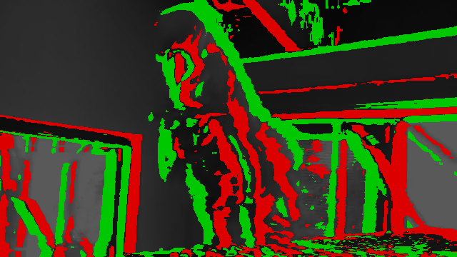

# maa 馬/ม้า

> 馬 (Japanese) / ม้า (Thai): *horse*. Named for Eadweard Muybridge's
> galloping horse (1878), the first photo sequence fast enough to show
> what happens between the frames the eye can see.

Minimal event-camera simulator, converts high-fps video into event
streams. 馬/ม้า: see Muybridge, 1878.

<!-- GIF: drop the headline demo here once results/ has one. -->


## Install

```bash
git clone https://github.com/neuenmiller/maa maa
cd maa
python -m venv .venv && source .venv/bin/activate
pip install -e .
```

## Run

Fetch some footage (data/ is gitignored), then simulate events and
reconstruct intensity to check them:

```bash
python data/fetch.py                 # populate data/ (stub for now)

python -c "import maa; print(maa.__version__)"   # smoke test
```

Once the API lands, the loop will be roughly: video in → `simulate` →
event stream → `noise` (optional) → `reconstruct` → frames out.

## Limitations

- frame-interpolated, not microsecond-accurate; see v2e for a serious simulator
- timing resolution is bounded by input video fps (plus interpolation)
- the noise model is a rough approximation of real sensor behavior

## Roadmap

- [ ] **First end-to-end demo GIF in `results/`** — 240 fps clip → log-intensity diffs → threshold → green/red events → GIF. Ugly, no noise, no reconstruction, but visible on day one.
- [ ] Implement `simulate` — threshold-crossing events from frames
- [ ] Implement `noise` — background activity, threshold jitter, hot pixels
- [ ] Implement `reconstruct` — integrate events back to intensity
- [ ] **v1 C++ kernel** (pybind11) — port the hot loop; validate against the NumPy oracle; benchmark NumPy events/sec → C++ speedup
- [ ] `experiments/reproduce_v2e` — sanity-check against v2e
- [ ] `experiments/e2vid_bench` — reconstruction benchmark
- [ ] `experiments/sim2real` *(v2 stretch)* — does sim-trained transfer to real events?
