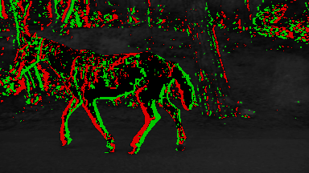

# maa 馬/ม้า

> 馬 (Japanese) / ม้า (Thai): *horse*. Named for Eadweard Muybridge's
> galloping horse (1878), the first photo sequence fast enough to show
> what happens between the frames the eye can see.

Minimal event-camera simulator, converts high-fps video into event
streams. 馬/ม้า: see Muybridge, 1878.



<sub>Green = brighter (ON), red = darker (OFF). Footage via [Vecteezy](https://www.vecteezy.com/free-videos/horse-slow).</sub>

## Install

```bash
git clone https://github.com/neuenmiller/maa maa
cd maa
python -m venv .venv && source .venv/bin/activate
pip install -e .
```

## Run

Smoke-test the install:

```bash
python -c "import maa; print(maa.__version__)"
```

Reproduce the headline GIF — drop a high-fps clip into the gitignored
`data/` by hand (`data/fetch.py` is still a stub), then:

```bash
python examples/demo.py --input data/clip.mp4      # -> results/demo.gif
```

No clip handy? Exercise the colour + GIF plumbing on a synthetic pattern
(write it somewhere throwaway so it doesn't clobber the committed GIF):

```bash
python examples/demo.py --selftest --output /tmp/selftest.gif
```

`simulate` turns the frames into a sparse `(x, y, t, p)` event stream and
the demo paints it green (ON) / red (OFF). Still to land: `noise`
(optional sensor noise) and `reconstruct` (integrate events back to
intensity). Full loop: video in → `simulate` → events → `noise` →
`reconstruct` → frames out.

## Limitations

- frame-interpolated, not microsecond-accurate; see v2e for a serious simulator
- timing resolution is bounded by input video fps (plus interpolation)
- the noise model is a rough approximation of real sensor behavior

## Roadmap

- [x] **First end-to-end demo GIF in `results/`** — 240 fps clip → log-intensity diffs → threshold → green/red events → GIF. Ugly, no noise, no reconstruction, but visible on day one.
- [x] Implement `simulate` — threshold-crossing events from frames; emit a sparse `(x, y, t, p)` event stream (struct-of-arrays)
- [x] Implement `noise` — background activity, threshold jitter, hot pixels
- [ ] Implement `reconstruct` — integrate events back to intensity
- [ ] `experiments/reproduce_v2e` — sanity-check against v2e. Run this **before** adding pixel-model sophistication: the diff against v2e *is* the requirements list — it names which of the candidates below actually move the output.
- [ ] **Pixel-model sophistication** — implement what the v2e diff demands, in NumPy, with tests. Deterministic pixel physics lives in `simulate` (the oracle holds no RNG); anything random stays in `noise`.
- [ ] **v1 C++ kernel** (pybind11) — port the hot loop *once the algorithm is frozen*; validate against the NumPy oracle; benchmark NumPy events/sec → C++ speedup
- [ ] `experiments/e2vid_bench` — reconstruction benchmark
- [ ] `experiments/sim2real` *(v2 stretch)* — does sim-trained transfer to real events?
- [ ] **v2+ — generalize past events** *(more of a direction, not a milestone)* — the pipeline is already sensor-shaped: scene → transduction → noise → reconstruction → evaluation. Pull that into a modality-agnostic core and the event camera becomes sensor #1, not the product.

## Sophistication candidates

Status: proposed → confirmed (the v2e diff says it matters) → landed (in
NumPy, with tests). Placement follows the roadmap rule — deterministic
physics in `simulate`, randomness in `noise`; factories draw a sensor
description once, the caller hands it to whichever stage consumes it.

| Candidate | Lives in | Status |
|---|---|---|
| per-pixel threshold variation (FPN) | factory in `noise`, map consumed by `simulate` | proposed |
| multiple events per over-threshold jump | `simulate` | proposed |
| sub-frame timestamps | `simulate` | proposed |
| shot noise (balanced ON/OFF, rate rises in the dark) | `noise` | proposed |
| intensity-dependent latency / bandwidth | `simulate` | proposed |
| asymmetric ON/OFF thresholds | `simulate` | proposed |
| dead pixels | `noise` | proposed |
